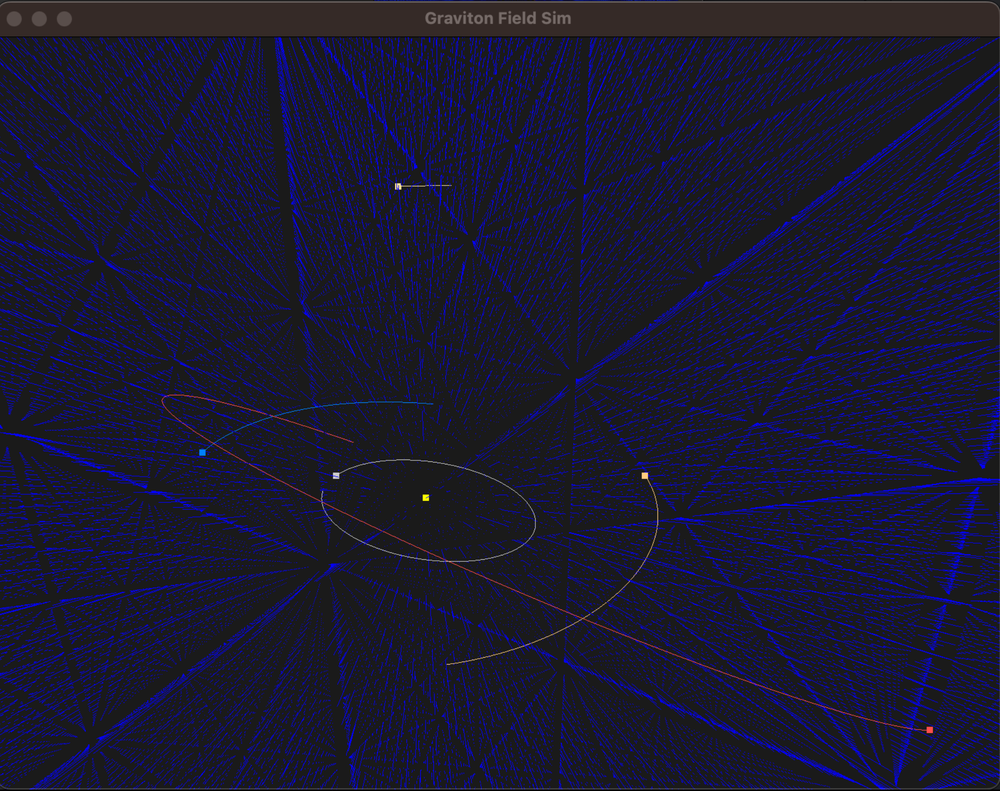

# Graviton Field Simulator


This is a physics simulator designed to test the plausibility of a graviton-based field substrate as the origin of spacetime curvature. Instead of Newtonian brute-force equations, this model propagates stress through a field of discrete graviton units using directional vector fields and inverse-distance falloff. Bodies don’t attract each other directly—they push the field, and the field pushes back.



### Concept
- The universe is computable.
- Spacetime isn’t a fabric—it’s a medium.
- Mass applies directional stress to that medium (the graviton field), and the field carries and redistributes momentum over time.
- This simulation explores whether a system like that can lead to emergent gravitational orbits.

### Key Features
- Gravitons are arranged in a 3D grid. Each has position, momentum, and accumulated force.
- Masses influence the field based on inverse-cubed distance.
- Field propagates force based on mass and distance, like SPH but directional.
- Masses react to local field stress instead of directly calculating attraction to each other.
- Trail rendering for orbit paths.
- Camera controls, pause/play toggle (SPACE).

## Why?

I have a fundamental problem with entropy and I eventually want to prove that the universe is computable.
The goal isn’t just to simulate gravity, but to simulate it through something—to prove that spacetime curvature can emerge from mass interacting with a quantised substrate.

### Dependencies
- GLFW
- GLAD
- OpenGL 4.1 (macOS-compatible)
- OpenMP for parallel force computation
- GLM for math

### Controls
- WASD – Move camera
- Mouse – Look around
- SPACE – Toggle simulation pause

## Building
Options:

A. Run from VSCode, should work on macOS at least if dependencies are installed

B. 
```shell
g++ src/main.cpp -std=c++17 -lglfw -ldl -lGL -fopenmp -o GravitonFieldSim
```

## Notes
- The simulation isn’t tuned for realism—it’s tuned to show that a field-based gravitational substrate can form emergent orbits.
- Performance will scale poorly without GPU compute. This is a CPU-based testbed only for now.

## License

MIT. Do what you want. Just don’t pretend you invented graviton fields if you got the idea here.